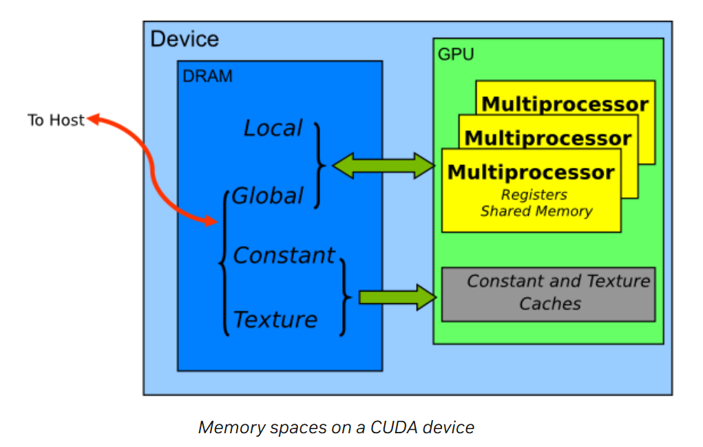

# 编译并运行代码
## 编译

1. 编译原始CPU代码
nvcc -std=c++11 -o nbody 01-nbody.cu
2. 编译nbody_parallel.cu，这是基础的GPU加速版本
nvcc -arch=sm_80 -o nbody_GPU_basic nbody_parallel.cu
3. 编译nbody_shared.cu, 这是做了内存优化的GPU加速版本
nvcc -arch=sm_80 -o nbody_GPU_shared nbody_shared.cu

## 运行效果

```
./nbody 4096 Bodies: average 0.081 Billion Interactions / second
./nbody_GPU_basic 4096 Bodies: average 32.320 Billion Interactions / second
./nbody_GPU_shared 4096 Bodies: average 197.147 Billion Interactions / second
```


## 性能分析——仅简要回答，详细分析在下一部分

- 通过launch kernel function，并行计算每个天体受到的引力，并行更新每个天体的坐标，nbody_parallel.cu比01-nbody.cu执行快
- `nbody_shared.cu`比`nbody_parallel.cu`快大约六倍，主要原因是：
  1. 提高并行度。先前并行的方式是每个线程计算一个天体与其他所有天体的相互作用，现在在计算每个天体时，使用`BLOCK_STRIDE`个进程并行计算该天体与其他所有天体的相互作用。
  2. 使用shared memory存取速度更快
  3. 使用shared memory减少访存次数
- `nbody_shared.cu`比`nbody_parallel.cu`快，主要因为修改了`bodyForce`这个kernel function的实现
- `nbody_shared.cu`比`01-nbody.cu`执行快大约1434倍，主要原因是充分利用gpu并行计算的能力，同时用`shared memory`优化访存速度
# 分析代码与加速原因

## 01-nbody.cu-N体模拟器的运算

- 每个天体的运动状态，是通过坐标和速度，`(x, y, z, vx, vy, vz)`来描述
- 考虑天体之间的引力相互作用，天体运行速度是不断变化的，取微元时间`dt`，在此期间近似为匀速直线运动
    ```c
    for (int i = 0; i < nBodies; i++)
        { // integrate position
            p[i].x += p[i].vx * dt;
            p[i].y += p[i].vy * dt;
            p[i].z += p[i].vz * dt;
        }
    ```
- 在每个微元之间后，更新每个天体的运动速度，近似为匀加速运动。具体方法是，将受力分解为`(x, y, z)`三个方向，计算每个天体受其他天体作用的合力，进而得到每个方向的加速度，以更新每个方向的速度`(vx, vy, vz)`
    ```c
    void bodyForce(Body *p, float dt, int n)
    {
        for (int i = 0; i < n; ++i)
        {
            // 计算每个天体在(x, y, z)方向，受到其他天体作用的合力
            float Fx = 0.0f;
            float Fy = 0.0f;
            float Fz = 0.0f;

            for (int j = 0; j < n; j++)
            {
                // 计算天体之间的距离
                float dx = p[j].x - p[i].x;
                float dy = p[j].y - p[i].y;
                float dz = p[j].z - p[i].z;
                float distSqr = dx * dx + dy * dy + dz * dz + SOFTENING;
                // 平方反比率
                // 三次方是为了后面计算cos，做力的分解
                float invDist = rsqrtf(distSqr);
                float invDist3 = invDist * invDist * invDist;
                // 分解到(x, y, z)三个方向
                Fx += dx * invDist3;
                Fy += dy * invDist3;
                Fz += dz * invDist3;
            }

            // 近似为匀加速，更新天体运行速度(vx, vy, vz)
            p[i].vx += dt * Fx;
            p[i].vy += dt * Fy;
            p[i].vz += dt * Fz;
        }
    }
    ```
- 在每一个微元运算时，先调用`bodyForce`更新每个天体的速度，然后更新每个天体的坐标
    ```c
    # 更新每个天体的速度
    bodyForce(p, dt, nBodies); // compute interbody forces
    # 更新每个天体的坐标
    for (int i = 0; i < nBodies; i++)
        { // integrate position
            p[i].x += p[i].vx * dt;
            p[i].y += p[i].vy * dt;
            p[i].z += p[i].vz * dt;
        }
    ```
- **原始版本是在cpu上串行计算，通过循环遍历每一个天体的方式，更新其速度和坐标**
  
## nbody_parallel.cu-在gpu上并行计算

### 代码思路分析
- **在gpu上并行运算，`bodyForce`中每个线程负责计算和更新一个天体的速度，`integrate_position`中每个线程负责更新一个天体的坐标**
    ```c
    // kernel function并行处理每个天体的方法，bodyForce的思路与此一致
    __global__ void integrate_position(Body *p, float dt, int n)
    {
        // 通过当前thread的编号和其所在的block的编号，索引到该线程负责计算的天体的编号
        int i = threadIdx.x + blockDim.x * blockIdx.x;
        // 更新该天体的坐标
        if (i < n)
        {
            p[i].x += p[i].vx * dt;
            p[i].y += p[i].vy * dt;
            p[i].z += p[i].vz * dt;
        }
    }
    ```
- `cudaMallocManaged`：分配一块统一内存空间，指针指向这块内存，可以在主机和设备之间共享
    ```c
    // 计算需要分配多少字节的空间
    int bytes = nBodies * sizeof(Body);
    float *buf;
    // 在cpu上分配空间
    // buf = (float *)malloc(bytes);
    // 在gpu上分配空间
    cudaMallocManaged(&buf, bytes);
    // 强制类型转换，将内存区域解释为Body类型的数据
    Body *p = (Body *)buf;
    ```
- launch kernel的参数中，因为一个warp有32个线程，所以`BLOCK_SIZE`应该为32的倍数。`numberOfBlocks`取决于天体的数量，在后续Nsight分析的时候，将探究`numberOfBlocks`对性能的影响
    ```c
    #define BLOCK_SIZE 32
    size_t threadsPerBlock = BLOCK_SIZE;
    size_t numberOfBlocks = (nBodies + threadsPerBlock - 1) / threadsPerBlock;
    ```

- Kernel在默认流中顺序执行，所以会先计算完每个天体的速度，再开始更新每个天体的位置
    ```c
    bodyForce<<<numberOfBlocks, threadsPerBlock>>>(p, dt, nBodies); // compute interbody forces
    integrate_position<<<numberOfBlocks,threadsPerBlock>>>(p,dt,nBodies);
    ```

### Nsight分析

## nbody_shared.cu

### 代码思路分析

- 用`BLOCK_STRIDE`个thread，并行计算一个天体与其他天体的相互作用，相比先前一个进程计算一个天体与其他天体的相互作用，并行度提高
  - 启动`numberOfBlocks * BLOCK_STRIDE`个block，在kernel中`BLOCK_STRIDE`个进程索引到同一个天体
    ```c
    // launch kernel的参数中，block的数量变为原来的BLOCK_STRIDE倍，总进程数变为原来的BLOCK_STRIDE倍(threadsPerBlock未变)，用于并行计算一个天体与其他天体的相互作用
    bodyForce<<<numberOfBlocks * BLOCK_STRIDE, threadsPerBlock>>>(d_p, dt, nBodies); // compute interbody forces

    __global__ void bodyForce(Body *p, float dt, int n)
    {
        // 先前每个进程计算一个天体与其他天体的相互作用
        // int i = threadIdx.x + blockIdx.x * blockDim.x;
        // 计算要处理的数据index
        // 现在BLOCK_STRIDE个进程索引到同一个天体
        int i = threadIdx.x + (int)(blockIdx.x / BLOCK_STRIDE) * blockDim.x;
        ...
    }
    ```
  - 每个天体要计算与其他n-1个天体的相互作用，在代码中体现为与n个天体进行计算（与自身的力为零）。将n个`Body`的数据，分成多个`page`，每个`page`有`BLOCK_STRIDE`个`block`。
  - 在并行计算的时候，索引到某个天体的有`BLOCK_STRIDE`个进程，其中每个进程负责计算`page`中第`blockIdx.x % BLOCK_STRIDE`个`block`中的天体数据，然后不断循环，跳转到下一个`page`中同样位置的`block`的天体数据，直到遍历完所有天体
  - 因为是并行计算所以在最后累加的时候，需要采取原子加，以避免竞争的现象
    ```c

    __global__ void bodyForce(Body *p, float dt, int n)
    {
        ...
        // 此块对应要处理的数据块的起始位置
        // 当前进程负责为索引到的天体，计算每个page中，第start_block块中包含的所有天体，对当前天体的相互作用
        int start_block = blockIdx.x % BLOCK_STRIDE;
        ...
        if (i < n)
        {
            // 需要roll over多少个page
            int cycle_times = n / BLOCK_SIZE;
            // 当前线程计算的天体
            Body ptemp = p[i];
            ...
            float dx, dy, dz, distSqr, invDist, invDist3;
            float Fx = 0.0f;
            float Fy = 0.0f;
            float Fz = 0.0f;
            // 这里的cycle_times 在已知块大小时使用常数性能会高一些
            // rollout the pages
            for (int block_num = start_block; block_num < cycle_times; block_num += BLOCK_STRIDE)
            {
                ...
                // spos中存储当前page，当前进程负责的block中所有天体的数据
                // 计算其中每一个天体与当前天体的相互作用
                for (int j = 0; j < BLOCK_SIZE; j++)
                {
                    dx = spos[j].x - ptemp.x;
                    dy = spos[j].y - ptemp.y;
                    dz = spos[j].z - ptemp.z;
                    distSqr = dx * dx + dy * dy + dz * dz + SOFTENING;
                    invDist = rsqrtf(distSqr);
                    invDist3 = invDist * invDist * invDist;
                    Fx += dx * invDist3;
                    Fy += dy * invDist3;
                    Fz += dz * invDist3;
                }
                ...
            }
            // 当前天体与其他天体的相互作用，被分到BLOCK_SIZE个进程计算，在每个进程计算完毕后，进程间的要累加起来计算合力
            // 由于块之间不同步，原子加保证正确性，避免竞争现象
            atomicAdd(&p[i].vx, dt * Fx);
            atomicAdd(&p[i].vy, dt * Fy);
            atomicAdd(&p[i].vz, dt * Fz);
            // p[i].vx += dt * Fx;
            // p[i].vy += dt * Fy;
            // p[i].vz += dt * Fz;
        }
    }
    ```

- 使用`shared memory`进行优化
    

  - 原先每个进程负责计算一个天体与其他天体的相互作用的时候，需要从global memory加载n个天体的数据，总共需要进行$n^2$次访存操作。此时每个天体数据都被重复访问n次，如果不同进程之间能够共享从global memory取得的天体数据，可以降低访存次数，进而加快运行速度
  - 共享内存后，访存次数变为`numberOfBlocks * n`次
  - 共享内存的scope是`All threads in block`，Lifetime是`Block`
    
    - 当allocate shared memory的时候，每个block里面都创建了一份同样大小却互相独立的share memory
    - 当进行`__syncthreads()`操作的时候，只能保证此block里的thread在同步，此block里的shared memory是同步的
  ```c
  __global__ void bodyForce(Body *p, float dt, int n)
  {
    ...
    // 此块对应要处理的数据块的起始位置
    int start_block = blockIdx.x % BLOCK_STRIDE;
    ...
    // 需要roll over多少个page
    int cycle_times = n / BLOCK_SIZE;
    // 使用shared_memory 多个线程读取同一块数据进入，提升存取性能
    // 在shared memory中，每个block都分得一块空间spos，block之间相互独立
    __shared__ float3 spos[BLOCK_SIZE];
    for (int block_num = start_block; block_num < cycle_times; block_num += BLOCK_STRIDE)
    {
        // block中每个进程负责从global memory取一个天体的数据到shared memory
        // 最终的效果是，该page中第start_block个块的天体数据被加载到spos中，被重复利用
        temp = p[block_num * BLOCK_SIZE + threadIdx.x];
        spos[threadIdx.x] = make_float3(temp.x, temp.y, temp.z);
        // 确保块内每个thread都完成自己的工作，即把它天体数据存到spos中
        // 块内同步，防止spos提前被读取
        __syncthreads();
        ...
        // for-loop 计算当前索引到的天体与BLOCK_SIZE个天体的相互作用
        ...
        // 确保块内每个thread都完成其自身索引到的天体，与spos中天体的相互作用的计算。然后才能进入下一次循环，加载下一批天体数据
        // 块内同步，防止spos提前被写入
        __syncthreads();
    }
  }
  ```
- 循环展开`#pragma unroll <Integer Constant Expression>`
  - 减少循环控制开销
  - 避免分支冲突
  - 循环展开会使用更多的寄存器，编译器在编译的过程中会将确定的量优先存储在寄存器。SM会根据一个块需要消耗的寄存器大小和线程的个数去分配该SM上块的个数，当一个SM连一个块都分配不了时，就会导致内核启动不了。**所以决定循环展开的次数，需要权衡寄存器大小和线程数量之间的关系**

# 实验不同的参数设置
## 改变nbody_parallel.cu中的BLOCK SIZE

| Experiment                    | Bodies | Block Size | Average Interactions / Second (Billion) |
|-------------------------------|--------|------------|-----------------------------------------|
| `./nbody_GPU_basic_1`          | 4096   | 1          | 14.749                                  |
| `./nbody_GPU_basic_2`          | 4096   | 2          | 27.311                                  |
| `./nbody_GPU_basic_3`          | 4096   | 3          | 29.439                                  |
| `./nbody_GPU_basic_4`          | 4096   | 4          | 32.508                                  |
| `./nbody_GPU_basic_8`          | 4096   | 8          | 33.737                                  |
| `./nbody_GPU_basic_16`         | 4096   | 16         | 31.649                                  |
| `./nbody_GPU_basic_30`         | 4096   | 30         | 33.268                                  |
| `./nbody_GPU_basic_31`         | 4096   | 31         | 33.852                                  |
| `./nbody_GPU_basic (32)`       | 4096   | 32         | 32.320                                  |
| `./nbody_GPU_basic_64`         | 4096   | 64         | 32.704                                  |
| `./nbody_GPU_basic_128`        | 4096   | 128        | 32.981                                  |
| `./nbody_GPU_basic_256`        | 4096   | 256        | 31.359                                  |
| `./nbody_GPU_basic_512`        | 4096   | 512        | 28.857                                  |
| `./nbody_GPU_basic_1023`       | 4096   | 1023       | 20.423                                  |
| `./nbody_GPU_basic_1024`       | 4096   | 1024       | 20.092                                  |
| `./nbody_GPU_basic_1025`       | 4096   | 1025       | 783.982                                 |

```
./nbody_GPU_basic_1
4096 Bodies: average 14.749 Billion Interactions / second
./nbody_GPU_basic_2
4096 Bodies: average 27.311 Billion Interactions / second
./nbody_GPU_basic_3
4096 Bodies: average 29.439 Billion Interactions / second
./nbody_GPU_basic_4
4096 Bodies: average 32.508 Billion Interactions / second
./nbody_GPU_basic_8
4096 Bodies: average 33.737 Billion Interactions / second
./nbody_GPU_basic_16
4096 Bodies: average 31.649 Billion Interactions / second
./nbody_GPU_basic_30
4096 Bodies: average 33.268 Billion Interactions / second
./nbody_GPU_basic_31
4096 Bodies: average 33.852 Billion Interactions / second
./nbody_GPU_basic (32)
4096 Bodies: average 32.320 Billion Interactions / second
./nbody_GPU_basic_64
4096 Bodies: average 32.704 Billion Interactions / second
./nbody_GPU_basic_128
4096 Bodies: average 32.981 Billion Interactions / second
./nbody_GPU_basic_256
4096 Bodies: average 31.359 Billion Interactions / second
./nbody_GPU_basic_512
4096 Bodies: average 28.857 Billion Interactions / second
./nbody_GPU_basic_1023
4096 Bodies: average 20.423 Billion Interactions / second
./nbody_GPU_basic_1024
4096 Bodies: average 20.092 Billion Interactions / second
./nbody_GPU_basic_1025
4096 Bodies: average 783.982 Billion Interactions / second
```


<figure style="text-align: center;">
  
  <figcaption>Compute Capability</figcaption>
</figure>

### 现象1-`BLOCK SIZE`取值从1-2，运行速度大致提高一倍
- A100有`108`个`SM`，`Maximum number of resident blocks per SM`为`32`
- 如果取`BLOCK SIZE = 1`，则最多并行`3456`个线程。那么由于每个`SM`能调度的`block`有限，`4096`个天体，需要分成两次，串行执行运算
- 如果取`BLOCK SIZE = 2`，则最多并行`6912`个线程。那么`4096`个天体，所有`block`能同时分配在`108`个`SM`上执行，所以速度大致快一倍
- GPU 一次可以调度 `SM 数量` * `每个 SM 最大 block 数`个 block，gpu完成每一批block的运算称作一个`wave`，在这个设备上一个`wave`是`3456`个block。如果`number of blocks`不能整除`wave`，则存在`tail effect`，这是当前现象的主要原因
  
### 现象2-`BLOCK SIZE`取值从2-4，运行速度不断提高
- block内的`memory coalescing`，一个block内的线程访问相近的`global memory`，使得加载的内存块可以充分利用
- 而`BLOCK SIZE`大于4，之后`memory coalescing`的优化已经充分发挥，所以速度几乎没有变化
  
### 现象3-在多次运行后发现`BLOCK SIZE`取值8-256时，运行速度差距不明显
- `Maximum number of resident blocks per SM`为32，`Maximum number of resident threads per SM`为2048，这意味着如果`BLOCK SIZE`小于64，可能无法充分利用SM上的线程资源。但是由于我们只计算`4096`个天体，所以`BLOCK SIZE`小于64不会显著影响运行速度
- 在这个区间内，`BLOCK SIZE`变化导致`number of blocks`随之变化，但是都能够合理地分配到每个`SM`上，所以运行速度没有明显变化
- 总之，因为只计算`4096`个天体，数据量较小，即使`occupancy`没有达到最优，一个`wave`也能完成计算，运行速度不会受到影响

### 现象4-`BLOCK SIZE`取值512-1024时，运行速度显著下降
- 每个block的寄存器数量和共享内存大小有限，如果`BLOCK SIZE`过大，结合每个线程需要的寄存器和共享内存数量，会导致资源拥挤需要排队现象
- 如果 `block 中线程的数量` * `每个线程所需的寄存器数量`大于 `SM` 支持的寄存器最大数量，kernel 就会启动失败。
  
### 现象5-`BLOCK SIZE`取值1025时，打印出的运行速度显著提高
- A100的`Compute Capability`是8.0，`Maximum number of threads per block`为1024
- 添加代码进行诊断，发现`CUDA Error: invalid configuration argument`，确实会导致`kernel launch`失败
    ```c
    cudaError_t err = cudaGetLastError();
    if (err != cudaSuccess) {
        printf("CUDA Error: %s\n", cudaGetErrorString(err));
        // Possibly: exit(-1) if program cannot continue....
    } 
    ```
- 此时速度提高是因为没有执行运算，就直接报错返回

### 现象6-`BLOCK SIZE`不是32的倍数没有显著影响运行速度
- 一个warp中有32个threads，即使最后一个 warp 中有效的线程数量不足 32，也要使用相同的硬件资源。理论上如果block_size不是32的倍数，可能会降低指令缓存的利用率，同时降低资源利用率
- 但在这里并没有引起显著影响，可能还是因为数据量小，一个`wave`就能搞定
  
## 改变nbody_shared.cu中的BLOCK SIZE与BLOCK STRIDE
| Experiment                          | Bodies | Block Size | Block Stride | Average Interactions / Second (Billion) |
|-------------------------------------|--------|------------|--------------|-----------------------------------------|
| `./nbody_GPU_shared_8_4`            | 4096   | 8          | 4            | 112.448                                  |
| `./nbody_GPU_shared_16_4`           | 4096   | 16         | 4            | 168.277                                  |
| `./nbody_GPU_shared_32_4`           | 4096   | 32         | 4            | 202.379                                  |
| `./nbody_GPU_shared_64_4`           | 4096   | 64         | 4            | 201.166                                  |
| `./nbody_GPU_shared (128)(4)`       | 4096   | 128        | 4            | 197.147                                  |
| `./nbody_GPU_shared_256_4`          | 4096   | 256        | 4            | 178.102                                  |
| `./nbody_GPU_shared_512_4`          | 4096   | 512        | 4            | 113.207                                  |

```
./nbody_GPU_shared_8_4
4096 Bodies: average 112.448 Billion Interactions / second
./nbody_GPU_shared_16_4
4096 Bodies: average 168.277 Billion Interactions / second
./nbody_GPU_shared_32_4
4096 Bodies: average 202.379 Billion Interactions / second
./nbody_GPU_shared_64_4
4096 Bodies: average 201.166 Billion Interactions / second
./nbody_GPU_shared （128）（4）
4096 Bodies: average 197.147 Billion Interactions / second
./nbody_GPU_shared_256_4
4096 Bodies: average 178.102 Billion Interactions / second
./nbody_GPU_shared_512_4
4096 Bodies: average 113.207 Billion Interactions / second
```

| Experiment                          | Bodies | Block Size | Block Stride | Average Interactions / Second (Billion) |
|-------------------------------------|--------|------------|--------------|-----------------------------------------|
| `./nbody_GPU_shared (128)(4)`       | 4096   | 128        | 4            | 197.147                                  |
| `./nbody_GPU_shared_128_8`          | 4096   | 128        | 8            | 227.026                                  |
| `./nbody_GPU_shared_128_16`         | 4096   | 128        | 16           | 246.724                                  |
| `./nbody_GPU_shared_128_32`         | 4096   | 128        | 32           | 256.532                                  |
| `./nbody_GPU_shared_128_64`         | 4096   | 128        | 64           | 184.163                                  |
| `./nbody_GPU_shared_128_128`        | 4096   | 128        | 128          | 126.716                                  |


```
./nbody_GPU_shared （128）（4）
4096 Bodies: average 197.147 Billion Interactions / second
./nbody_GPU_shared_128_8
4096 Bodies: average 227.026 Billion Interactions / second
./nbody_GPU_shared_128_16
4096 Bodies: average 246.724 Billion Interactions / second
./nbody_GPU_shared_128_32
4096 Bodies: average 256.532 Billion Interactions / second
./nbody_GPU_shared_128_64
4096 Bodies: average 184.163 Billion Interactions / second
./nbody_GPU_shared_128_128
4096 Bodies: average 126.716 Billion Interactions / second
```
### 现象1-固定`BLOCK Stride`增加`BLOCK SIZE`运行速度先升高后降低
- 增加`BLOCK SIZE`
- 提高共享内存重复利用的次数，减少访问`global memory`的次数
### 现象1-固定`BLOCK SIZE`增加`BLOCK Stride`运行速度先升高后降低

`BLOCK SIZE`设置为`Maximum number of resident threads per SM / Maximum number of resident blocks per SM`可以最大化`occupancy`，A100上这个值是`64`

# 参考

https://docs.nvidia.com/cuda/cuda-c-best-practices-guide/index.html

https://docs.nvidia.com/cuda/cuda-c-programming-guide/

https://dorianzi.github.io/2020/04/02/cuda-shared-memory/

https://docs.nvidia.com/cuda/cuda-c-programming-guide/index.html#compute-capabilities

https://developer.nvidia.com/cuda-gpus